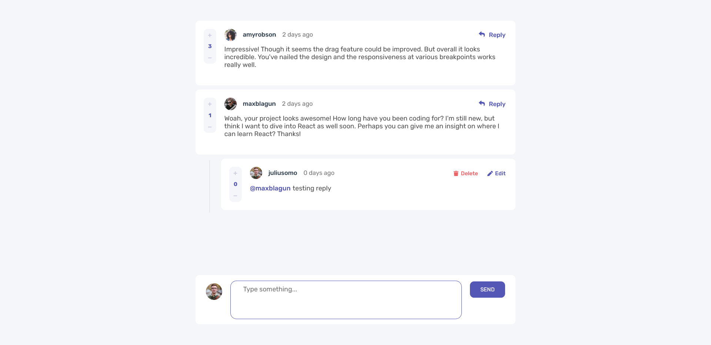

# Frontend Mentor - Solução para a seção interativa de comentários

Esta é uma solução para o [Interactive comments section challenge on Frontend Mentor](https://www.frontendmentor.io/challenges/interactive-comments-section-iG1RugEG9)

## Visão Geral

### O Desafio

Os usuários devem ser capazes de:

- Visualizar o layout ideal para o aplicativo, dependendo do tamanho da tela de seu dispositivo
- Ver estados de hover para todos os elementos interativos na página
- Criar, Ler, Atualizar e Excluir comentários e respostas
- Dar upvote e downvote em comentários
- **Bonus**: Se você estiver construindo um projeto puramente front-end, use localStorage para salvar o estado atual no navegador, que persiste quando o navegador é atualizado.
- **Bonus**: Em vez de usar as strings createdAt do arquivo data.json, tente usar timestamps e rastrear dinamicamente o tempo desde que o comentário ou resposta foi postada.

### Imagens

## Meu processo

### Desenvolvido com

- Marcação HTML5 Semântica
- Propriedades personalizadas CSS
- Flexbox
- CSS Grid
- [React](https://reactjs.org/) - Biblioteca JS
- [SpringBoot](https://spring.io/projects/spring-boot) - Biblioteca Java
- [MySql](https://www.mysql.com/) - Sistema de gerenciamento de banco de dados

### O que aprendi

#### Grid e Flexbox

Ampliei enormemente meus conhecimentos em Grid e Flexbox, e desenvolvi bastante minhas habilidades em design responsivo.

#### React com Typescript

Ampliei meus conhecimentos em torno do React, que era uma biblioteca que eu ja possuia conhecimento, porém apenas com Javascript. Com meu conhecimento prévio da tecnologia não acabou sendo muito desafiador,
exceto pela parte do gerenciamento de estado global com Redux, que eu dediquei um bom tempo aprendendo como ela funcionava com Typescript.

#### API RESTful com Java Spring Boot

Foi meu primeiro contato com a tecnologia, então de fato foi bastante desafiador. Como foi o meu primeiro projeto utilizando Spring Boot, acabei não implementando técnicas de proteção a API, como o JSON Web Tokens por exemplo.
Apliquei boas práticas no desenvolvimento de APIs, como códigos de retorno padronizados, tratamento de erros personalizados, além de padrão SOLID.

#### Mysql

Eu já possuia um conhecimento prévio de SQL, porém foi extremamente desafiador para mim a implementação do sistema de Upvotes nos comentários, o que me rendeu boas horas pesquisando.

### Recursos úteis

- [Formação Spring Boot - Alura](https://cursos.alura.com.br/formacao-spring-boot-3) - Essa formação me ajudou bastante no aprendizado, e boas práticas no desenvolvimento de APIs RESTful com Spring boot.

## Autor

- Linkedin - [@juan-gabriel-sa](https://www.linkedin.com/in/juan-gabriel-sa/)
